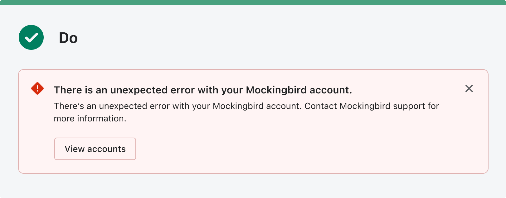
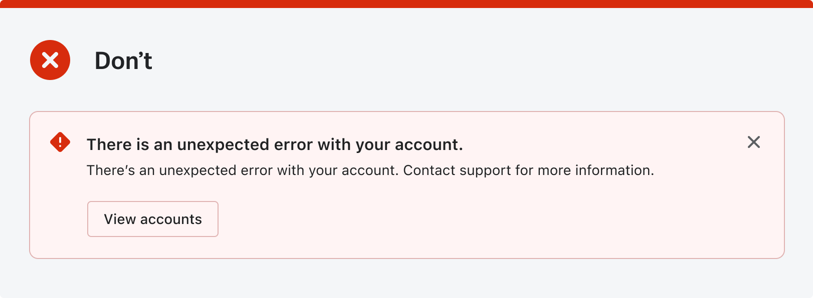
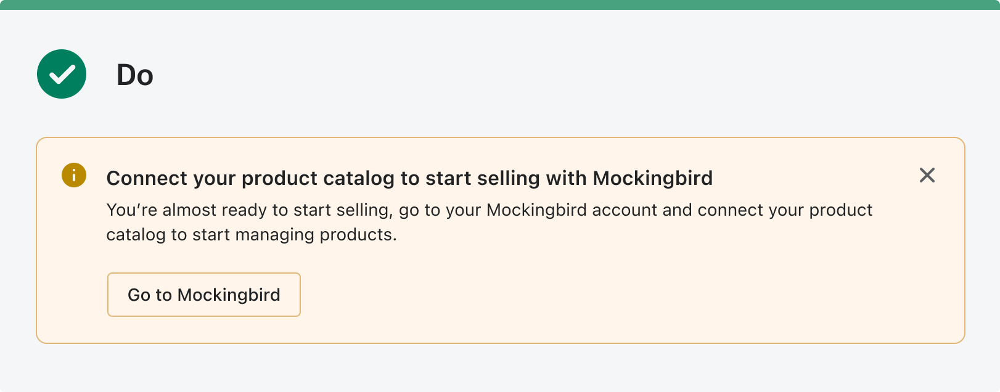

# Content guidelines

We know that your platform has its own voice and tone, and it’s ok to preserve them in the channel. However, channels are part of Shopify and merchants don’t see them as a separate experience.

When you’re creating content for a sales channel, use Shopify’s [voice and tone guide](https://polaris.shopify.com/content/voice-and-tone) to validate your decisions.

> Note
>
> > When building the channel, use feature names and titles from your platform without altering and make sure they refer to the same things in Shopify.

---

## Specific content use cases

Channels are a bridge between Shopify and your platform. Unique messages and patterns may be required to communicate correctly, and they will differ from what merchants are used to seeing in Shopify. That’s okay.

---

## Communicating external errors

Sometimes our merchants might run into errors that are caused by something out of Shopify’s control. We have patterns in place for internal errors, but this is how we would communicate an external problem.

|                                                                                               |                                                                                                     |
| --------------------------------------------------------------------------------------------- | --------------------------------------------------------------------------------------------------- |
|  |  |

**Best practices:**

1. Make it clear that the issue requires contacting specialists on your platform.
2. Provide an easy way for merchants to contact you.
3. Be as clear as possible about what happened.

---

## Action required outside of Shopify

While merchants are setting up their channel they may need to take an action outside of Shopify. Make sure to be as clear as possible outlining merchant’s next steps.

|                                                                                                                         |                                                                                                                               |
| ----------------------------------------------------------------------------------------------------------------------- | ----------------------------------------------------------------------------------------------------------------------------- |
|  |  |

**Best practices:**

1. Tell merchants where they need to go to resolve the issue, and be clear about when they are leaving Shopify
2. Provide a direct link or guide them
3. Tell merchants what they need to do after they leave Shopify

---

## Important channel updates

If there are new requirements for your channel or important information that merchants need to know, communicate them as early and as directly as possible. Mention the impact on the merchant’s store or sales, if any. Don’t rely on email or external communication, as merchants often miss it.

|                                                                                           |                                                                                                 |
| ----------------------------------------------------------------------------------------- | ----------------------------------------------------------------------------------------------- |
|  |  |

**Best practices:**

1. Tell the merchants if any action is required of them
2. When possible, add a relevant date or time
3. Let merchants know how long this announcement may affect them and if there are any consequences
4. If there’s ever impact on their store or sales, be up front
5. Link to a solution or provide documentation on the change
